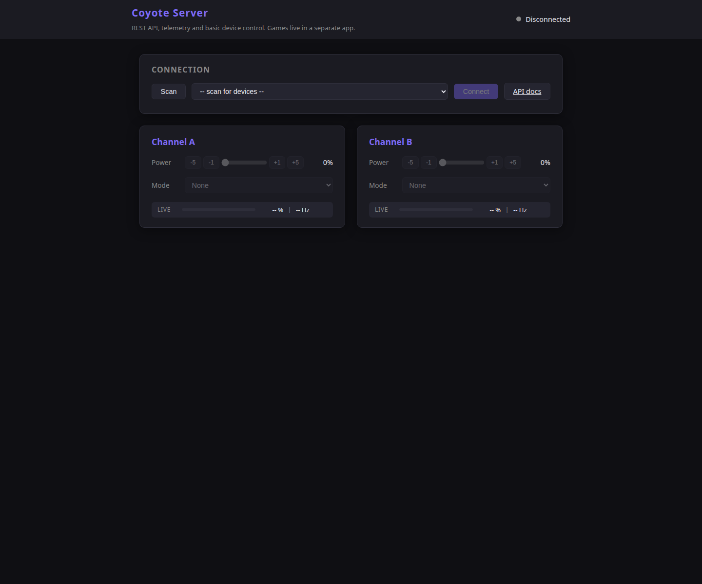

# coyote-server

[](https://github.com/thalarion210/coyopy-server/actions/workflows/ci.yml)

Standalone FastAPI server and lightweight browser UI for the DG-Labs Coyote.

## Scope

This repository contains:

- a REST API for scan, connect, disconnect and channel control
- an outbound-only WebSocket stream for live device events
- a small no-build browser UI for administration and testing

This repository does not contain game logic. Game-oriented flows belong in separate applications that consume coyopy directly or talk to this server over HTTP and WebSocket.

## Dependency model

coyote-server is intentionally decoupled from coyopy source code.

- It depends on coyopy as an external package requirement.
- It does not vendor or copy coyopy modules.
- CI installs coyopy from GitHub, not from a sibling checkout.

At the moment coyopy is referenced directly from GitHub because it is not yet available on PyPI:

```text
coyopy @ git+https://github.com/thalarion210/coyopy.git@main
```

Once coyopy is published to PyPI, this should be replaced with a normal versioned dependency.

## Screenshot



## Installation

### End users

```bash
python -m venv .venv
source .venv/bin/activate
pip install --upgrade pip
pip install .
```

### Developers

```bash
python -m venv .venv
source .venv/bin/activate
pip install --upgrade pip
pip install -r requirements-dev.txt
```

In this multi-root workspace you can also bind the sibling coyopy checkout directly for development:

```bash
pip install -e ../coyopy
pip install -e .
```

That keeps local development tied to the neighboring repository checkout while Docker and GitHub builds continue to use the declared packaged dependency.

## Run

```bash
python main.py
```

Then open:

- http://127.0.0.1:8000 for the browser UI
- http://127.0.0.1:8000/docs for the OpenAPI UI

Alternative starts:

```bash
coyote-server
```

```bash
uvicorn coyote_server.main:app --reload
```

Environment variables used by the entrypoint:

- COYOTE_SERVER_HOST, default 0.0.0.0
- COYOTE_SERVER_PORT, default 8000
- COYOTE_SERVER_RELOAD, default false

## API summary

### Device endpoints

- POST /api/scan
- POST /api/connect
- POST /api/disconnect
- GET /api/status

### Channel endpoints

- GET /api/channel/{a|b}
- PUT /api/channel/{a|b}/power
- PUT /api/channel/{a|b}/mode
- PUT /api/channel/{a|b}/pattern

### WebSocket

- GET /ws
- outbound events: connected, disconnected, battery, power, mode, frame, error

See docs/API.md for request and response details.

## Development checks

```bash
python -m ruff check .
python -m mypy coyote_server
python -m pytest
python -m build
```

Current validated state in this workspace:

- 99 tests passing
- 98% coverage
- mypy clean on coyote_server
- package build succeeds

## Repository layout

- coyote_server/ contains the packaged FastAPI application
- tests/ contains API, model, state, websocket and entrypoint tests
- coyote_server/web/ contains the packaged static browser UI
- docs/ contains API and development notes

## Docker deployment

The repository supports a split deployment model with two services:

- an API container running FastAPI and device logic
- a web container running nginx for static assets and reverse proxying /api, /ws and /docs to the API

Build locally:

```bash
docker build -f Dockerfile.api -t coyote-server-api .
docker build -f Dockerfile.web -t coyote-server-web .
```

Run locally as two containers:

```bash
export GHCR_OWNER=your-github-user-or-org
docker compose -f compose.deploy.yml up
```

The example compose file publishes the web frontend on port 8080 and keeps the API internal.

Optional image tag override:

```bash
export COYOTE_SERVER_TAG=v0.1.0
```

For Linux BLE access on Unraid, the API container may need additional host-specific configuration such as DBus mounts, device mappings or elevated privileges depending on how Bluetooth is exposed on your server.

## GitHub container pipeline

The workflow in .github/workflows/docker.yml builds two images:

- ghcr.io/<owner>/coyote-server-api
- ghcr.io/<owner>/coyote-server-web

Behavior:

- pull requests build both images without publishing
- pushes to main build and publish fresh images
- version tags like v0.2.0 publish versioned image tags

This is designed for direct consumption from Unraid via GHCR.

## GitHub readiness

The repository is prepared for GitHub with:

- a multi-version CI workflow
- ignore rules for caches, coverage outputs and build artifacts
- package metadata for wheel and sdist builds
- standalone documentation that does not rely on a monorepo sibling checkout

## Notes

- The browser UI is intentionally simple and aimed at device administration, not game logic.
- For reproducible releases you should pin the coyopy dependency to a tag or commit instead of main.
